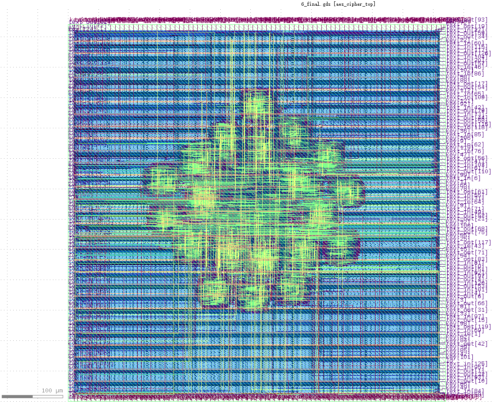
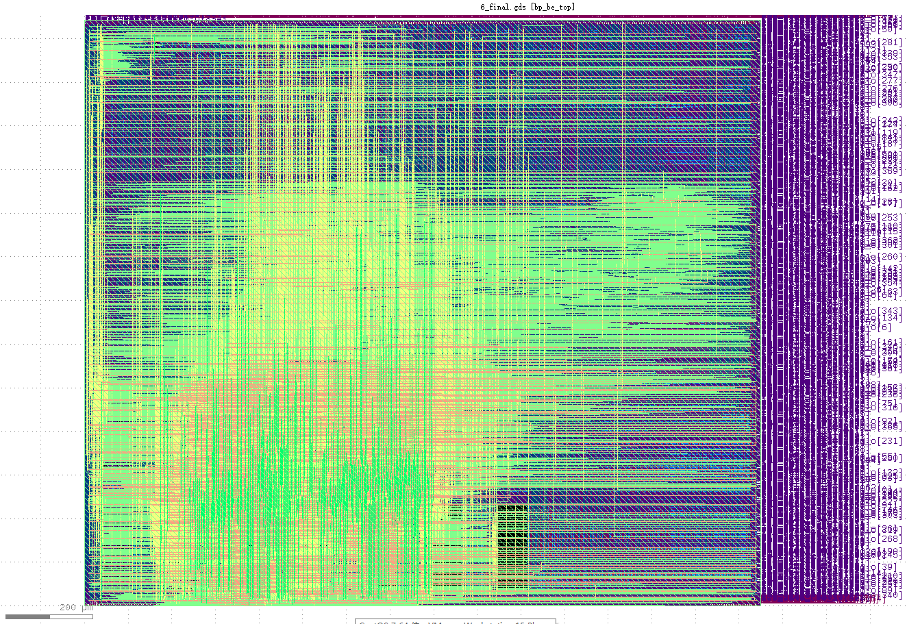
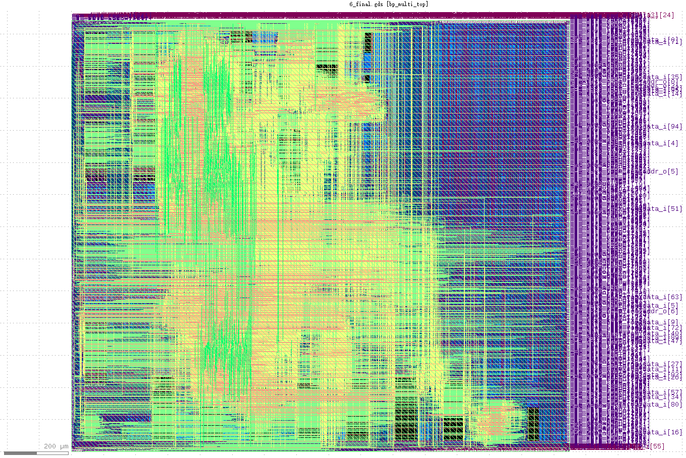
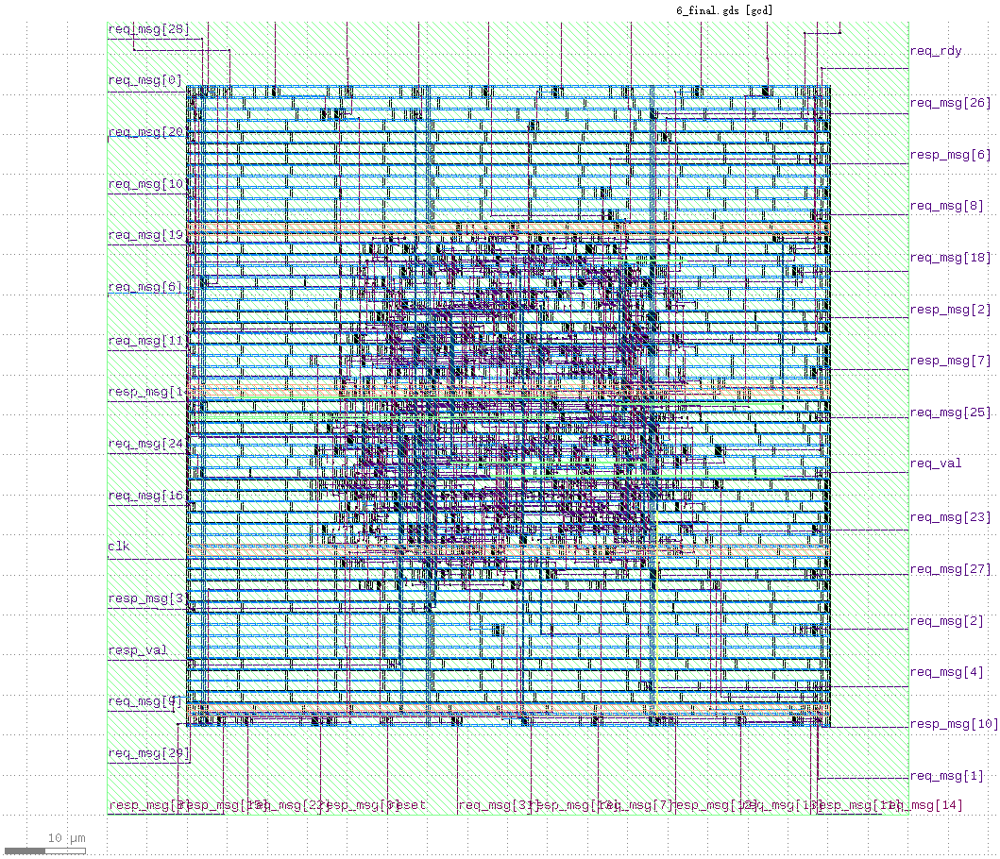
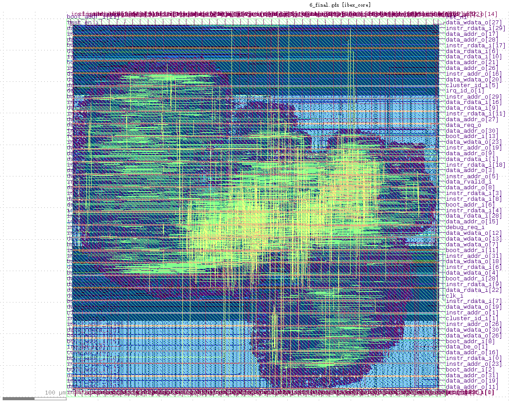
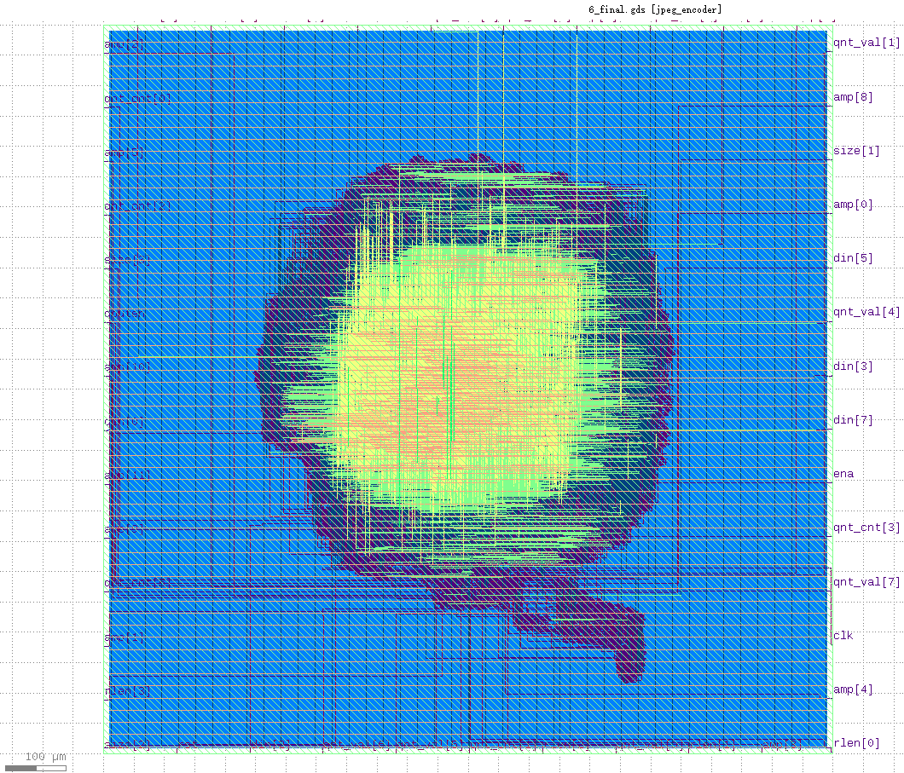
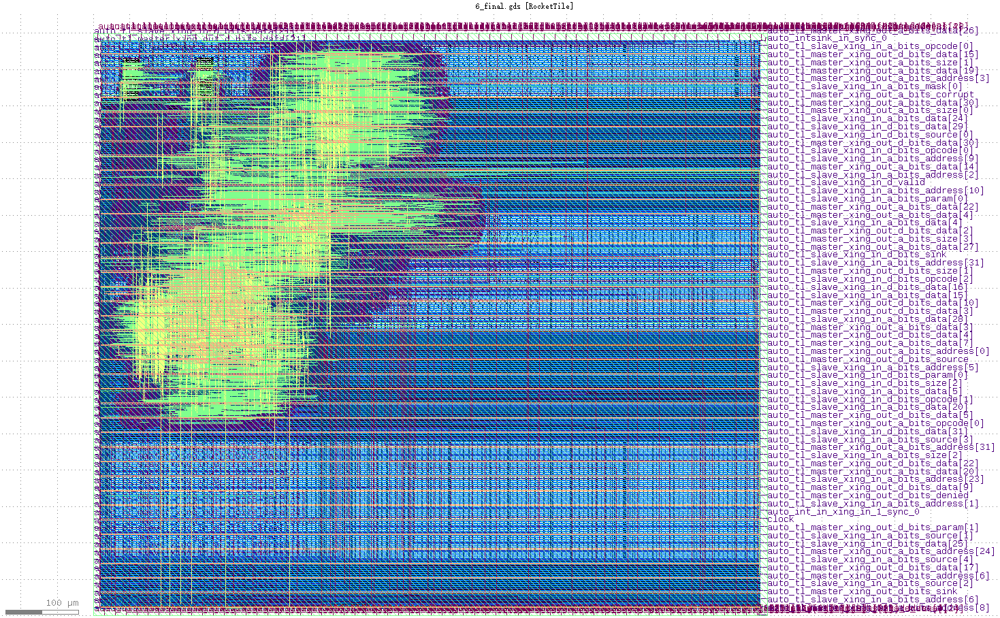
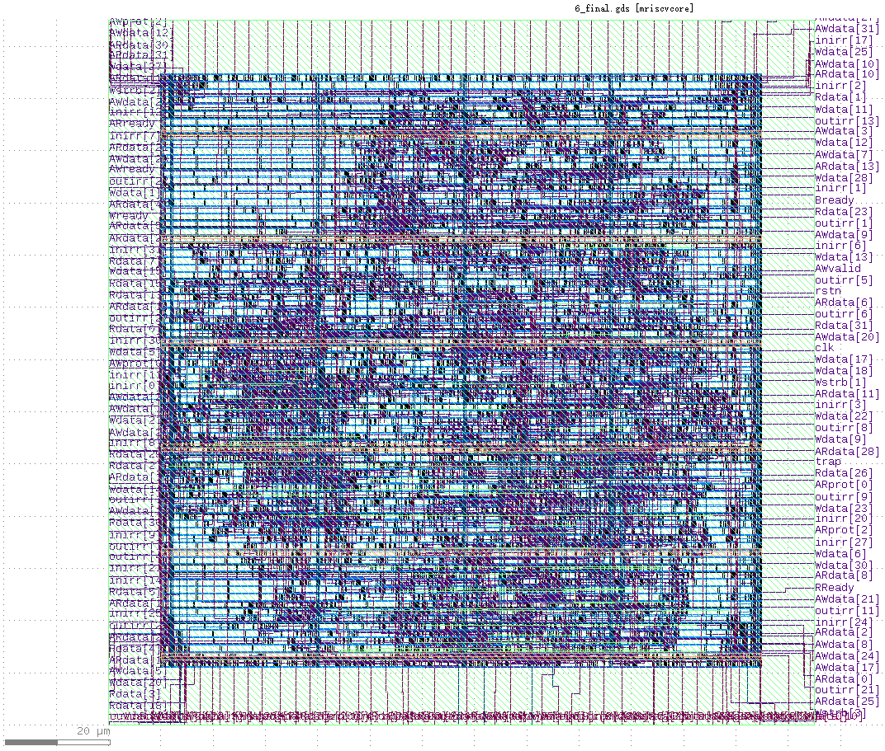
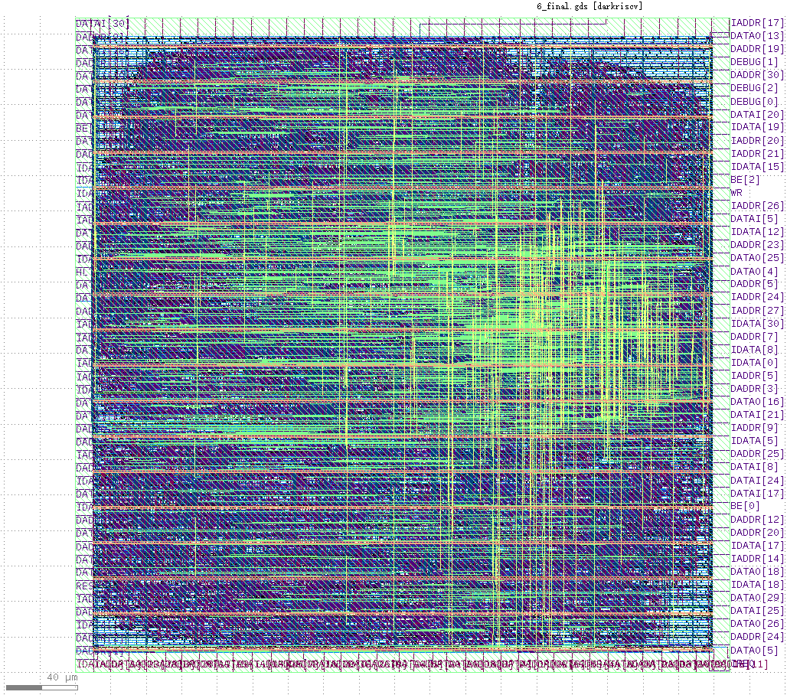

# 《高级计算机系统结构》课程Project实验报告

## 王重熙 201928013229111

本文是中国科学院大学《高级计算机体系结构》课程实验报告，使用开源的OpenROAD-flow工具链完成芯片从RTL设计到GDS版图的全流程。

实验报告使用Markdown文件格式编写，转为PDF格式后字体较小，建议调整为200%查看。如果有互联网连接，可以直接访问https://github.com/nicolaswilde/UCAS-Advanced-Computer-Architecture-OpenROAD-flow/blob/master/report/report.md 查看实验报告排版效果更佳，https://github.com/nicolaswilde/UCAS-Advanced-Computer-Architecture-OpenROAD-flow/ 这个repository中的内容与在课程网站上提交的内容完全一致。

## 1 实验内容

### 1.1 实验目标

使用开源的EDA工具链，探索完成小规模芯片从RTL代码设计到GDS的全流程，包括：架构设计、前端RTL设计、综合、后端物理设计（包括布局、 时钟树综合、布线、时序分析等），其中RTL设计可以自行设计，也可以使用开源芯片的RTL设计。

开源EDA工具使用OpenROAD-flow，Github仓库见https://github.com/The-OpenROAD-Project/OpenROAD-flow 。

### 1.2 OpenROAD-flow的流程

OpenROAD-flow从RTL代码到GDS版图的全部流程如下图所示，RTL设计的Verilog代码及其它设计和约束文件经过综合（Synthesis）、布图规划（Floorplanning）、布局（Placement）、时钟树综合（Clock Tree Synthesis）、布线（Routing）等过程得到最终的GDS版图：

- 逻辑综合（Logic Synthesis）

    逻辑综合是OpenROAD工作流程的第一步，RTL设计经过逻辑综合得到描述逻辑门连接的门级网表netlist，OpenROAD-flow使用开源的Yosys + ABC工具进行逻辑综合。

- 物理设计（Physical Design）

    物理设计的目的是从逻辑电路（门级网表）得到芯片制造所需要的版图，版图描述了晶体管和晶体管在不同层中的布局，以及导线互联，芯片的版图以GDSII文件格式保存，称为GDS版图。

    从门级网表netlist到GDS版图需要经过以下几步：

    - 布图规划（FloorPlanning）

        布图规划是为了确定芯片主要模块的位置，主要确定以下几项内容：

        1. 芯片的面积；

        2. 门和电线的尺寸；

        3. 输入引脚和输出引脚的位置；

        4. 电力输送网络PDN（Power Delivery Network）；

        5. 芯片中IP块的位置以及与IO引脚的连接等。

        OpenROAD-flow使用verilog2def、ioPlacer、MacroPlacer、PDN和tapcell等开源工具完成布图规划。

    - 布局（Placement）

        布局是确定不同电路元件具体位置的步骤，将电路元件（cell）对应到布图上的详细坐标。布局分为全局布局（Global Placement）和详细布局（Detailed Placement）：全局布局将所有cell分布到相应位置，可能带有一些重叠；详细布局将每个cell移动到附近的不重叠的合法位置。

        OpenROAD-flow使用RePIAce、Resizer和OpenDP等开源工具完成布局。

    - 时钟树综合（Clock Tree Synthesis）

        时钟树综合是将时钟信号均匀分布到电路中的过程，尽可能减少clock skew和延迟。

        OpenROAD-flow使用TritonCTS完成时钟树综合。

    - 布线（Routing）

        每个cell的位置在布局中被确定下来，布线则是确定cell间连线的路径。

        OpenROAD-flow使用FastRoute工具进行全局布线，使用TritonRoute工具进行详细布线。

    - 完成物理设计

        OpenROAD最后将DEF文件转换为GDS版图。

## 2.1 实验环境搭建

### 2.1.1 安装CentOS 7虚拟机

OpenROAD-flow支持MacOS、Windows、Linux等多种操作系统，不过开发者仅在CentOS 7上完成了测试，因此我在Windows上使用VMWare搭建了CentOS 7虚拟机作为本次实验的平台，VMWare的版本是VMWare Workstation 15 Player，CentOS 7的镜像是CentOS 7 x86_64 18.04。

我参照https://blog.csdn.net/babyxue/article/details/80970526 完成了CentOS 7虚拟机的搭建，分配了8G DDR4-2400内存，40G硬盘空间，CPU是8核Core i7-7700HQ。

### 2.1.2 安装OpenROAD-flow

参照https://github.com/The-OpenROAD-Project/OpenROAD-flow 安装OpenROAD-flow，一共有三种安装方法：
- Option1 Installing build exports，下载pre-build的安装包，不需要自己编译；
- Option2 Building the tools using docker，使用docker搭建；
- Option3 Building the tools locally，不使用docker，直接在本地环境中搭建。

我从Option1开始尝试，结果Option1安装失败；之后使用Option2安装成功。

#### 2.1.2.1 Option1

OpenROAD-flow第一种安装方法分为四步：

1. 首先使用git clone克隆OpenROAD-flow的仓库：

        git clone --recursive https://github.com/The-OpenROAD-Project/OpenROAD-flow.git

2. 直接从下面的网址下载pre-build好的安装包：

    https://github.com/The-OpenROAD-Project/OpenROAD-flow/releases/tag/alpha2

3. 将下载的tar解压到`OpenROAD-flow/tools/OpenROAD`文件夹

4. 使用下面的命令更新环境变量：

        source setup_env.sh

安装完毕后，使用以下三条命令测试安装的正确性：

    yosys -h
    openroad -h
    TritonRoute -h

问题1

- 问题描述：

    当使用` git clone --recursive https://github.com/The-OpenROAD-Project/OpenROAD-flow.git`复制OpenROAD仓库时，产生下面的错误：

        Cloning into 'src/FastRoute'...
        remote: Enumerating objects: 227, done.
        remote: Counting objects: 100% (227/227), done.
        remote: Compressing objects: 100% (126/126), done.
        error: RPC failed; result=18, HTTP code = 200iB | 6.00 KiB/s
        fatal: The remote end hung up unexpectedly
        fatal: early EOF
        fatal: index-pack failed
        Clone of 'https://github.com/The-OpenROAD-Project/FastRoute.git' into submodule path 'src/FastRoute' failed
        Failed to recurse into submodule path 'tools/OpenROAD'

- 原因分析：

    子模块FastRoute克隆失败，在克隆FastRoute时下载速度只有几KB/s，首先怀疑是访问github时产生的网络问题。

    进入OpenROAD-flow目录，使用`git submodule update --init --recursive`尝试再次更新子目录，发现克隆FastRoute子模块时再次失败；但是奇怪的是，根据`.gitmodules`文件中找到的子模块链接，直接使用命令`git clone --recursive https://github.com/The-OpenROAD-Project/FastRoute.git`就可以克隆成功。

- 解决方法：

    在`tools/OpenROAD/src`中直接执行`git clone --recursive https://github.com/The-OpenROAD-Project/FastRoute.git`，即可将FastRoute子模块克隆下来，之后返回OpenROAD-flow目录继续使用`git submodule update --init --recursive`完成OpenROAD-flow的下载。

    后续还有几个子模块包括OpenDB、replace等都遇到了同样的问题，解决方法也相同。

问题2

- 问题描述:

    安装完毕后，运行`yosys -h`、`openroad -h`和`TritonRoute -h`报错`command not found...`，查看`setup_env.sh`，发现加入`$PATH`的三个路径分别是`${modroot}/build/OpenROAD/src`、`${modroot}/build/TritonRoute`和`${modroot}/build/yosys/bin`，然而从https://github.com/The-OpenROAD-Project/OpenROAD-flow/releases 下载下来的安装包按照README规定的解压位置解压后，对应的可执行文件分别位于`${modroot}/OpenROAD/build/src`、`${modroot}/OpenROAD/build/src/TritonRoute`和`${modroot}/OpenROAD/build/src/yosys`。

    修改`setup_env.sh`文件，将正确的路径加入到`$PATH`后，运行`yosys -h`和`openroad -h`均报错`error while loading shared libraries: libtcl8.5.so: cannot open shared object file: No such file or directory`。

- 原因分析：

    首先是release、README和master branch不匹配的问题，在Alpha2 prebuilt binaries for CentOS 7发布之后OpenROAD-flow的master branch有200多次提交，虽然没有定位到具体的哪一个commit，但是`setup_env.sh`和OpenROAD-flow的目录结构应该有改动，造成了安装的失败。此外`yosys -h`和`openroad -h`提示找不到共享库，可能是发布的OpenROAD-flow prebuilt版本并不是完全免安装的，依然需要安装一些dependency的库，但是README中并没有说明。

- 解决方法：

    无。Option1安装失败，release或README需要更新。接下来尝试Option2。

#### 2.1.2.1 Option2

OpenROAD-flow第二种安装方法分为三步：

1. 使用git clone克隆OpenROAD-flow的仓库，这一步与Option1中相同

2. 确保docker守护程序（docker daemon）运行且`docker`命令被添加到了`$PATH`中，之后使用docker进行build：

    ./build_openroad.sh

3. 在docker容器中打开交互式shell：

    docker run -it -u $(id -u ${USER}):$(id -g ${USER}) openroad/flow bash

OpenROAD-flow的仓库在尝试Option1的安装方法时已经克隆到了本地。

我参照https://www.cnblogs.com/yufeng218/p/8370670.html 在CentOS中安装了docker，docker版本号为docker-ce-19.03.9-3。由于docker daemon最初没有运行，使用下面的命令将docker daemon加入到开机启动项中：

    systemctl enable docker

由于网络问题，我在执行`./build_openroad.sh`曾多次出错，主要发生在`git clone https://github.com/The-OpenROAD-Project/abc.git`和`yum install`，这些错误再次运行`./build_openroad.sh`即可解决；此外下面问题3和问题4中的错误需要修改Dockerfile。

问题3

- 问题描述：

    运行`./build_openroad.sh`创建docker镜像，报错：

        Loaded plugins: fastestmirror, ovl
        Cannot open: https://centos7.iuscommunity.org/ius-release.rpm. Skipping.
        Error: Nothing to do
        The command '/bin/sh -c yum group install -y "Development Tools"     && yum install -y https://centos7.iuscommunity.org/ius-release.rpm     && yum install -y wget centos-release-scl devtoolset-8     devtoolset-8-libatomic-devel tcl-devel tcl tk libstdc++ tk-devel pcre-devel     python36u python36u-libs python36u-devel python36u-pip &&     yum clean -y all &&     rm -rf /var/lib/apt/lists/*' returned a non-zero code: 1

- 原因分析：

    在浏览器中打开https://centos7.iuscommunity.org/ius-release.rpm ，发现连接到了一个github的issue：https://github.com/iusrepo/announce/issues/18 ，现在https://centos7.iuscommunity.org/ius-release.rpm 的链接不再维护，现在维护的是https://repo.ius.io/ius-release-el7.rpm 。

- 解决方法：

    将`OpenROAD-flwo/tools/OpenROAD/Dockerfile`第6行的`https://centos7.iuscommunity.org/ius-release.rpm`修改为`https://repo.ius.io/ius-release-el7.rpm`，再次运行`./build_openroad.sh`即可。

问题4

- 问题描述：

    解决问题3后， 再次运行`./build_openroad.sh`报错：

        https://hkg.mirror.rackspace.com/epel/7/x86_64/repodata/ea5cfe85e50491bfba7524d64236cd8a954f1b59e82813857e2f2e90d5de5a45-updateinfo.xml.bz2: [Errno 14] curl#7 - "Failed connect to hkg.mirror.rackspace.com:443; Connection refused"
        Trying other mirror.
        No package git2u available.
        Error: Nothing to do
        The command '/bin/sh -c yum -y remove git && yum install -y git2u' returned a non-zero code: 1

- 原因分析：

    在Google中搜索相关问题，发现一个类似的Github issue：https://github.com/iusrepo/git216/issues/5 ，issue中提到`yum --enablerepo=ius-archive install git2u`可以正确安装git2u。

- 解决方法：

    将`OpenROAD-flow/tools/OpenROAD/Dockerfile`第25行的`RUN yum -y remove git && yum install -y git2u`修改为`RUN yum -y remove git && yum install -y --enablerepo=ius-archive git2u`，之后再次运行`./build_openroad.sh`成功。

安装完毕后运行`docker images`，可以看到列表中出现openroad、openroad/flow、openroad/yosys和openroad/tritonroute等四个镜像。

使用`docker run -it openroad/flow bash`在docker容器中打开交互式shell，运行`source setup_env.sh`更新环境变量，运行`yosys -h`、`openroad -h`和`TritonRoute -h`测试安装的正确性，安装成功！

## 3 OpenROAD-flow工具链demo从RTL到GDS全流程

如`OpenROAD-flow/flow/Makefile`第1行到第48行所示，OpenROAD-flow有数十个demo，支持的平台包括nangate45、tsmc65lp、gf14、invecas12、sw130等等。

OpenROAD-flow默认只安装了nangate45的平台，因此我只测试了使用nangate45的12个demo，包括aes、black_parrot、bp_be_top、bp_fe_top、bp_multi_top、dynamic_node、gcd、ibex、jpeg、swerv、swerv_wrapper和tinyRocket。

### 3.1 gcd

OpenROAD-flow通过`DESIGN_CONFIG`这个变量来指定具体的设计，demo中默认的是最简单的gcd模块，只需要大约几百个cell，我首先完成完成`gcd.v`在nangate45平台上从verilog到GDS版图的全流程：

    docker run -it openroad/flow bash
    cd flow
    make

问题5

- 问题描述：

    `make`报错：

        /usr/bin/time: cannot run klayout: No such file or directory
        0:00.00elapsed 73%CPU 360memKB
        make: *** [results/nangate45/gcd/6_1_merged.gds] Error 127

- 原因分析：

    怀疑是klayout未安装成功。

- 解决方法：

    参照`OpenROAD-flow/Dockerfile`第六行，在openroad/flow的docker容器中运行`yum localinstall https://www.klayout.org/downloads/CentOS_7/klayout-0.26.4-0.x86_64.rpm -y`。

手动安装klayout后`make`成功，得到gcd的GDS版图。

### 3.2 其它的11个demo

在完成gcd从RTL到GDS的全流程后，说明OpenROAD-flow工具链安装正确且运行无误，接下来我又完成了其它的11个demo从RTL到GDS的全流程：

    docker run -it openroad/flow bash
    cd flow

    make DESIGN_CONFIG=./designs/nangate45/aes.mk
    make DESIGN_CONFIG=./designs/nangate45/black_parrot.mk
    make DESIGN_CONFIG=./designs/nangate45/bp_be_top.mk
    make DESIGN_CONFIG=./designs/nangate45/bp_fe_top.mk
    make DESIGN_CONFIG=./designs/nangate45/bp_multi_top.mk
    make DESIGN_CONFIG=./designs/nangate45/dynamic_node.mk
    make DESIGN_CONFIG=./designs/nangate45/ibex.mk
    make DESIGN_CONFIG=./designs/nangate45/jpeg.mk
    make DESIGN_CONFIG=./designs/nangate45/swerv.mk
    make DESIGN_CONFIG=./designs/nangate45/swerv_wrapper.mk
    make DESIGN_CONFIG=./designs/nangate45/tinyRocket.mk

其中swerv_wrapper出现bug，bug详细信息见问题6，其余均完成从RTL到GDS的全流程。

问题6

- 问题描述：

    运行`make DESIGN_CONFIG=./designs/nangate45/swerv_wrapper.mk`报错：

        make: *** [results/nangate45/swerv_wrapper/3_2_place_resized.def] Error 9

- 原因分析：

    在docker容器中打开`OpenROAD-flow/flow/logs/nangate45/swerv_wrapper`文件夹查看所有产生的log文件，发现log文件只产生到`3_2_resizer.log`，说明只进行到了使用Resizer工具进行详细布局这一步。打开`OpenROAD-flow/flow/logs/nangate45/swerv_wrapper/3_2_resizer.log`，发现总负时序裕量TNS（Total Negative Slack）和最差负时序裕量WNS（Worst Hold Slack）均为负值：

        ==========================================================================
        report_tns
        --------------------------------------------------------------------------
        tns -2654963.25

        ==========================================================================
        report_wns
        --------------------------------------------------------------------------
        wns -346.61

    最差负时序裕量WNS出现在这条路径上：

        ==========================================================================
        report_checks
        --------------------------------------------------------------------------
        Startpoint: _253006_ (rising edge-triggered flip-flop clocked by core_clock)
        Endpoint: _260932_ (recovery check against rising-edge clock core_clock)
        Path Group: **async_default**
        Path Type: max

        Delay    Time   Description
        ---------------------------------------------------------
        0.00    0.00   clock core_clock (rise edge)
        0.00    0.00   clock network delay (ideal)
        0.00    0.00 ^ _253006_/CK (DFFR_X1)
        0.08    0.08 v _253006_/Q (DFFR_X1)
        0.04    0.12 v _233754_/Z (BUF_X1)
        0.04    0.15 ^ _179879_/ZN (INV_X1)
        0.03    0.18 ^ _226933_/ZN (OR2_X1)
        0.03    0.21 ^ _226934_/ZN (AND2_X1)
        66.08   66.28 ^ _250135_/Z (BUF_X1)
        275.18  341.46 ^ _260932_/RN (DFFR_X1)
             341.46   data arrival time

        10.00   10.00   clock core_clock (rise edge)
        0.00   10.00   clock network delay (ideal)
        0.00   10.00   clock reconvergence pessimism
              10.00 ^ _260932_/CK (DFFR_X1)
        -15.14   -5.14   library recovery time
              -5.14   data required time
        ---------------------------------------------------------
              -5.14   data required time
            -341.46   data arrival time
        ---------------------------------------------------------
            -346.61   slack (VIOLATED)

    因此判断可能是时序违例，达不到要求的时钟频率。在docker容器中打开swerv_wrapper的设计文件`OpenROAD-flow/flow/designs/nangate45/swerv_wrapper.mk`，发现设定的是时钟频率是100MHz：

        export CLOCK_PERIOD = 10.000

    将时钟改为50MHz，即`export CLOCK_PERIOD = 20.000`，清除上一次的数据`make clean_all make DESIGN_CONFIG=./designs/nangate45/swerv_wrapper.mk`，重新运行`make DESIGN_CONFIG=./designs/nangate45/swerv_wrapper.mk`，依然出现相同的错误，且TNS和WNS完全一致，没有任何改变。

- 解决方法：

    无。swerv_wrapper的RTL到GDS全流程失败，时序违例且违例得非常离谱（346.61 ns），应该不是正常设计会出现的bug，没有找到bug原因。

### 3.3 demo总结

我使用OpenROAD-flow工具链完成了自带的demo中nangate平台上11个demo的RTL到GDS全流程，唯一失败的demo是swerv_wrapper，失败原因见问题6。

生成的11个demo的GDS版图由于文件大小的原因不能在实验报告中提交原始的.gds文件，于是我使用KLayout软件打开.gds文件截图进行提交，由于每个设计的版图大小不同，因此截图的缩放倍率不同，每张截图的左下角都标注了GDS版图单位网格的长度：

- aes

    

- black_parrot

    

- black_parrot backend

    

- black_parrot frontend

    

- black_parrot multi

    

- dynamic_node

    

- gcd

    

- ibex

    

- jpeg

    

- swerv

    

- tinyRocket

    

在`OpenROAD-flow/flow/logs/nangate45/design_name/`和`OpenROAD-flow/flow/reports/nangate45/design_name/`中，可以看到具体每一个设计的RTL到GDS全流程的日志和报告，下表是`OpenROAD-flow/flow/reports/nangate45/design_name/6_final_report.rpt`中最终报告的每个芯片设计的功耗（Power）和面积（Design Area）。

Name         | Power (mW) | Design Area (um^2)
:----------: | :--------: | :----------------:
aes          | 1.59E-03   |  1438128
black_parrot | 5.52E+02   | 20003624
bp_be_top    | 2.92E+02   |  8534981
bp_fe_top    | 3.21E+02   |  3556117
bp_multi_top | 8.53E+02   |  9117903
dynamic_node | 2.26E-03   |   737122
gcd          | 2.89E-05   |    25593
ibex         | 3.20E-03   |  1341146
jpeg         | 8.41E-03   |  5570072
swerv        | 1.03E-02   |  8088562
tinyRocket   | 5.62E+01   |  2830570

## 4 向OpenROAD-flow中添加新的design

### 4.1 RTL设计：rv32_toy

为了熟悉向OpenROAD-flow中添加新的RTL设计的方法，我选择了一个小规模的CPU设计进行尝试。rv32_toy是本学期EDA工具及设计实践课程中我们小组的一个RV32I指令集的CPU设计，verilog源代码由周盈坤同学提供，源代码位于实验报告文件夹的`flow/src/rv32_toy/`目录下。

rv32_toy是一个基于RV32I指令集设计的静态五级流水CPU，rv32_toy的结构非常简单：CPU核包含前端（FrontEnd）和后端（BackEnd）两个模块；前端负责取指令，包含FetchInst模块用于取指，以及BTB和RAS模块用于分支预测；后端包含InstDecoder模块用于译码，ALU模块用于运算，以及Regfile通用寄存器堆模块和CSRFile状态与控制寄存器。

### 4.2 添加相关文件

以rv32_toy为例，需要向OpenROAD-flow中添加三类文件，当然这些文件都是添加在docker容器中的：

1. 在`OpenROAD-flow/flow/designs/src/rv32_toy/`文件夹中添加所有RTL设计的verilog源代码

2. 在`OpenROAD-flow/flow/designs/src/rv32_toy/`文件夹中添加约束文件`rv32_toy.sdc`，通常约束文件中只需要生成时钟约束，在这里将时钟频率暂时先设置为常用的100MHz，注意时钟信号get_ports的名字要与RTL设计中保持一致：

        create_clock [get_ports clock] -period 10

3. 在`OpenROAD-flow/flow/designs/nangate45/`文件夹中添加`rv32_toy.mk`文件，mk文件中共export了8个参数：

        export DESIGN_NICKNAME = rv32_toy
        export DESIGN_NAME = Core
        export PLATFORM    = nangate45

        export VERILOG_FILES = $(wildcard ./designs/src/rv32_toy/*.v)
        export SDC_FILE      = ./designs/src/rv32_toy/rv32_toy.sdc

        export DIE_AREA    = x1 y1 x2 y2
        export CORE_AREA   = x1 y1 x2 y2

        export CLOCK_PERIOD = 10.000

这些参数中，DESIGN_NICKNAME、DESIGN_NAME、PLATFORM、VERILOG_FILES、SDC_FILE等五项参数非常好理解，分别设定为对应的名称和文件路径即可，注意DESIGN_NAME需要与RTL设计的顶层模块名称一致。需要自己研究确定的是DIE_AREA、CORE_AREA和CLOCK_PERIOD这三项参数，给它们赋一个合法的值得到GDS版图并不难，不过我想为它们找到固定工艺下更小的设计尺寸，DIE_AREA和CORE_AREA这两项参数的确定方法将在下一节4.3节中介绍。

### 4.3 mk文件中的DIE_AREA和CORE_AREA参数

#### 4.3.1 DIE_AREA和CORE_AREA的含义

DIE_AREA和CORE_AREA这两个参数规定了物理设计的面积，每个参数均由四个数字组成，对应两个点的坐标(x1, y1)和(x2, y2)。为了更好地理解DIE_AREA和CORE_AREA的含义，下表是第三章中成功完成RTL到GDS全流程的11个demo的详细数据，包括：

- `OpenROAD-flow/flow/designs/nangate45/design_name.mk`设计文件中的DIE AREA和CORE AREA

- `OpenROAD-flow/flow/reports/nangate45/design_name/synth_stat.txt`综合得到的Cell数目

- `OpenROAD-flow/flow/reports/nangate45/design_name/3_post_resize.rpt`布局之后报告的芯片面积（Design Area）和利用率（Utilization）

- `OpenROAD-flow/flow/reports/nangate45/design_name/6_final_report.rpt`完成所有流程后最终报告的芯片面积（Design Area）和利用率（Utilization）。

Name         | DIE AREA (um) (x1, y1) (x2, y2) | CORE AREA (um) (x1, y1) (x2, y2)     | # Cells | Placement Design Area (um^2) | Placement Utilization (%) | Final Design Area (um^2) | Final Utilization (%)
:----------: | :-----------------------------: | :----------------------------------: | :-----: | :--------------------------: | :-----------------------: | :----------------------: | :-------------------:
aes          | (0, 0)   ( 620.15,  620.6)   | (10.07, 11.2)   ( 610.27,  610.8) |  19571  | 112168                       | 8                         |  1438128                 | 100
black_parrot | (0, 0)   (2200.01, 2199.4)   | (10.07, 11.2)   (2189.94, 2189.6) | 218035  | 2651572                      | 14                        | 20003624                 | 105
bp_be_top    | (0, 0)   (1550.02, 1342.6)   | (10.07, 11.2)   (1540.14, 1332.8) |  72715  | 1032332                      | 13                        |  8534981                 | 106
bp_fe_top    | (0, 0)   ( 999.97,  799.4)   | (10.07,  9.8)   ( 989.9 ,  789.6) |  45088  | 848266                       | 28                        |  3556117                 | 116
bp_multi_top | (0, 0)   (1550.02, 1342.6)   | (10.07, 11.2)   (1540.14, 1332.8) | 132400  | 1954760                      | 24                        |  9117903                 | 113
dynamic_node | (0, 0)   ( 450.17,  450  )   | (10.07, 11.2)   ( 440.29,  440.2) |  16512  | 123876                       | 17                        |   737122                 | 100
gcd          | (0, 0)   ( 100.13,  100.8)   | (10.07, 11.2)   (  90.25,   91  ) |    431  | 2625                         | 10                        |    25593                 | 100
ibex         | (0, 0)   ( 600.08,  599.8)   | (10.07, 11.2)   ( 590.01,  590  ) |  39075  | 260432                       | 19                        |  1341146                 | 100
jpeg         | (0, 0)   (1200.04, 1199.8)   | (10.07,  9.8)   (1189.97, 1190  ) |  87227  | 566000                       | 10                        |  5570072                 | 100
swerv        | (0, 0)   (1550.02, 1342.6)   | (10.07, 11.2)   (1540.14, 1332.8) | 130858  | 929266                       | 11                        |  8088562                 | 100
tinyRocket   | (0, 0)   ( 924.92,  799.4)   | (10.07,  9.8)   ( 914.85,  789.6) |  38636  | 272215                       | 10                        |  2830570                 | 100

从上表中DIE_AREA、CORE_AREA、Final Design Area和Final Utilization这四列数据中可以看出：

1. DIE_AREA的(x1, y1)固定为(0, 0)

2. `Final Design Area = 4 * (CORE_AREA_x2 - CORE_AREA_x1) * (CORE_AREA_y2 - CORE_AREA_y1) * Final Utilization`，说明CORE_AREA这项参数规定了预设的芯片面积，且CORE_AREA中x2-x1和y2-y1代表的并不是芯片的长和宽，而是长和宽的一半，(x2, y2)这个坐标标注的是芯片设计的中间点。

3. CORE_AREA的(x1, y1)取值大约固定为(10, 10)，代表DIE比CORE在每一侧都多出20um左右的空间，具体取值中的(10.07, 11.2)和(10.07, 9.8)是为了让(x, y)能够整除(0.19, 1.4)，(0.19, 0.14)应该是布局时的基本单元尺寸，由工艺参数决定。不过经过测试，DIE_AREA和CORE_AREA中的参数没必要精准写成(0.19, 0.14)的倍数，工具链会自动进行取整。

4. DIE_AREA和CORE_AREA基本满足x2 = y2，也就是芯片的形状是正方形。

#### 4.3.2 芯片面积的估计

为了确定DIE_AREA和CORE_AREA的具体数值，需要对芯片需要的设计面积进行大体上的预估。关于芯片的面积，由于工艺限制，单位面积内的晶体管数目是固定的，因此直觉的估计是：需要的晶体管数目越多，芯片面积越大，于是我希望能够建立综合报告中Cell数目与最终芯片面积的近似的线性关系。

不幸的是，OpenROAD-flow工具链demo中DIE_AREA和CORE_AREA参数的设置并没有设置到最小值，也就是说最终的芯片中会有冗余的面积，demo中的aes、dynamic_node、gcd、ibex、jpeg、swerv、tinyRocket等设计中实际利用率并没有达到100%，例如gcd的CORE_AREA设定为(10.07, 11.2), (90.25, 91)，这样gcd最终的设计面积为`4 * (90.25 - 10.07) * (91 - 11.2) = 25593 um^2`，我从(100, 100)开始，按照(10, 10)的步长依次减小CORE_AREA的(x2, y2)的数值，当CORE_AREA = (10.07, 11.2), (60, 60)时依然可以正确产生GDS版图，此时最终芯片的设计面积仅有9478 um^2；当CORE_AREA = (10.07, 11.2), (50, 50)时报错：

    [ERROR] Filler area is negative!!
    Please put higher target density or Re-floorplan to have enough coreArea

说明此时才真正达到了gcd芯片面积的下限。

为了更直观地感受芯片设计面积减小带来的GDS版图的变化，下图是gcd设计的CORE_AREA (x2. y2)参数从(100, 100)按步长依次减小至(60, 60)所生成的GDS版图的截图，截图中缩放比例一致，每格均为10 um。从GDS版图的截图中可以直观地看到版图的面积越来越小，空闲的面积越来越少，最终几乎版图上的所有位置都被填满。

上面这部分叙述说明的是：上表中的Final Design Area并不是芯片真正需要的最小设计面积，因此不能拿来与Cell数目进行线性回归；另外对每一个demo都进行类似上述对gcd进行的寻找最小面积的工作太耗费时间，因此为了尝试建立Cell数目与芯片面积的线性关系，我采用了布局之后的Placement Design Area和Placement Utilization进行估计，从上表中的数据可以做出这样的估计：

- Cell数目与Placement Design Area有近似的正比例关系，Placement Design Area等于5.73 ~ 18.81倍的Cell数目，且除去black_parrot相关的设计，其余所有demo的Placement Design Area与Cell数目的比值都处于5.73 ~ 7.10的区间，因此估计`Placement Design Area = 6 * Cell数目`。

- 在上述关于gcd设计的测试中，最小面积时也就是CORE_AREA = (10.07, 11.2), (60, 60)时，Placement Utilization = 27%，出于设计的不同略微放宽要求，假设Placement Utilization小于25%即可正常生成出GDS版图，因此估计：`Final Design Area = 4 * Placement Design Area = 24 * Cell数目`。

因此，从Final Design Area就可以计算出`CORE_AREA_x2 = CORE_AREA_y2 = sqrt(Final Design Area / 4) + 10 = sqrt(6 * Cell数目) + 10`，而`DIE_AREA_x2 = DIE_AREA_y2 = CORE_AREA_x2 + 10`。

### 4.4 完成rv32_toy的RTL到GDS全流程

参照4.2节描述的那样添加需要的文件，目前mk文件中不确定的参数有三个：DIE_AREA、CORE_AREA和CLOCK_PERIOD，不妨先将DIE_AREA和CORE_AREA设置为非常小的数值例如"0 0 100 100"和"10.07 11.2 90 90"，将CLOCK_PERIOD设置为10.000（主频100MHz）。运行`make DESIGN_CONFIG=./designs/nangate45/rv32_toy.mk`开始rv32_toy从RTL到GDS的全流程，当然这次不会成功，只会正确执行完逻辑综合，因为设置的芯片面积太小了。在运行失败后，我们需要的是在`OpenROAD-flow/flow/reports/nangate/rv32_toy/synth_stat.txt`中找到Cell数目Number of cells: 69004，根据4.3.2节中介绍的估算芯片面积的方法，估算出DIE_AREA = "0 0 663 663"，CORE_AREA = "10.07 11.2 653 653"，修改`OpenROAD-flow/flow/designs/nangate45/rv32_toy.mk`文件中的相应参数。

再次运行之前，首先使用`make clean_all DESIGN_CONFIG=./designs/nangate45/rv32_toy.mk`清除掉之前的数据，之后执行`make DESIGN_CONFIG=./designs/nangate45/rv32_toy.mk`，完成rv32_toy从RTL到GDS的全流程，rv32_toy得到的版图如下图所示，4.3.2节中估计的芯片面积还比较准确。

## 5 开源RISCV处理器核的RTL到GDS全流程

### 5.1 开源RISCV处理器核

参照老师给出的RISCV处理器核的列表网站https://github.com/riscv/riscv-cores-list ，我找出了该网站中列举的所有在Github中开源源代码且语言为Verilog的RISCV处理器核，包括：

Name            | Source Code URL                                                        | ISA Version | Supplier      | License
:-------------: | :--------------------------------------------------------------------: | :---------: | :-----------: | :-----:
mriscv          | https://github.com/onchipuis/mriscvcore/tree/master                    | RV32I       | OnChipUIS     | MIT
HummingbirdE203 | https://github.com/SI-RISCV/e200_opensource/tree/master/rtl/e203       | RV32IMAC    | Bob Hu        | Apache 2.0
picorv32        | https://github.com/cliffordwolf/picorv32/blob/master/picorv32.v        | RV32I       | Clifford Wolf | ISC
serv            | https://github.com/olofk/serv/tree/master/rtl                          | RV32I       | Olof Kindgren | ISC
biriscv         | https://github.com/ultraembedded/biriscv/tree/master/src               | RV32IM      | UltraEmbedded | Apache 2.0
darkriscv       | https://github.com/darklife/darkriscv/tree/master/rtl                  | RV32I       | Darklife      | BSD
tinyriscv       | https://github.com/liangkangnan/tinyriscv/tree/master/rtl/core         | RV32I       | Blue Liang    | Apache 2.0

### 5.2 开源RISCV处理器核RTL到GDS全流程结果对比

参照第4章中描述的向OpenROAD-flow中添加新的设计的方法，我使用OpenROAD工具链完成了5.1节中列举的7个开源RISCV处理器核的RTL到GDS全流程，这些设计的源代码和sdc文件见实验报告目录下`/flow/designs/src/design_name/`，mk文件见实验报告目录下`/flow/designs/nangate/design_name.mk`，最终的GDS版图截图见实验报告目录下`/GDS/`。mk文件中DIE_AREA和CORE_AREA均按照4.3.2节中的方法进行估计，仅在serv和biriscv中有所调整；时钟频率均设定为100MHz。在这里报告以下这些处理器核RTL到GDS全流程的相关数据：

Name            | DIE AREA (um) (x1, y1) (x2, y2) | CORE AREA (um) (x1, y1) (x2, y2)     | # Cells | Power (mW) | Final Design Area (um^2) | Final Utilization (%)
:-------------: | :-----------------------------: | :----------------------------------: | :-----: | :--------: | :----------------------: | :-------------------:
mriscv          | (0, 0)   (135, 135)          | (10.07, 11.2)   (125, 125)        | 2218    | 2.47e-04   | 52055                    | 100
HummingbirdE203 | (0, 0)   (444, 444)          | (10.07, 11.2)   (434, 434)        | 29925   | 1.89e-03   | 716883                   | 100
picorv32        | (0, 0)   (309, 309)          | (10.07, 11.2)   (299, 299)        | 13941   | 1.34e-03   | 331542                   | 100
serv            | (0, 0)   (112, 112)          | (10.07, 11.2)   (102, 102)        | 1406    | 1.78e-04   | 39102                    | 100
biriscv         | (0, 0)   (830, 830)          | (10.07, 11.2)   (820, 820)        | 109418  | 6.41e-03   | 2616561                  | 100
darkriscv       | (0, 0)   (369, 369)          | (10.07, 11.2)   (359, 359)        | 20248   | 1.82e-03   | 484469                   | 100
tinyriscv       | (0, 0)   (435, 435)          | (10.07, 11.2)   (425, 425)        | 28717   | 5.62e+01   | 2830570                  | 100

它们的版图同样使用KLayout软件打开.gds文件截图进行提交：

- mriscv

    

- HummingbirdE203

    

- picorv32

    

- serv

    

- biriscv

    

- darkriscv

    

- tinyriscv

    

可以看到，这些版图的利用率较高，相比于demo中的11个版图有着明显的提高，说明4.3.2节中对OpenROAD-flow工具链生成芯片面积的估计比较准确。

## 6 总结

### 6.1 工作回顾

本文主要进行了以下四方面的工作：

1. 在CentOS虚拟机中使用docker成功安装OpenROAD-flow工具链。

2. 使用OpenROAD-flow工具链成功完成11个demo的RTL到GDS全流程。

3. 实现向OpenROAD-flow工具链中添加新的设计rv32_toy，并根据demo摸索出准确设置DIE_AREA和CORE_AREA的方法。

4. 使用OpenROAD-flow工具链成功完成7个开源的RISCV处理器核的RTL到GDS全流程。

实验的所有流程均在本文中展示，读者可根据本文逐步完成OpenROAD-flow工具链的安装与使用。

由于实验得到的文件夹太大，无法在课程网站上提交，因此我将实验得到的所有GDS版图截图并在本文中展示。由于课程网站的容量限制，我在课程网站中提交的实验报告文件夹包括这些内容;

- `/report.pdf`，实验报告pdf，即本文。

- `/GDS/`，所有19个生成的GDS版图文件的截图。

- `/flow/designs/src/...`，所有的源文件及SDC文件。

- `/flow/designs/nangate45/`，所有的mk文件。

- `/flow/reports/nangate45/...`，所有OpenROAD-flow生成的报告。

将以上`/flow/designs/`文件夹中的所有内容拷贝到docker容器对应文件夹中即可完整复现本文中的所有实验内容。

完整的`/flow/`文件夹放在百度网盘上：https://pan.baidu.com/s/1W-uYokpS5s0O5UtC7FIe9w ，提取码：rx5o，完整的flow文件夹中主要包括：

- `/designs/`，所有的设计文件，包括`/designs/src/design_name/`中的verilog源代码以及SDC文件，还有`/designs/nangate45/design_name.mk`的mk文件。

- `/logs/nangate45/`，OpenROAD-flow工具链生成的日志文件，每个设计对应一个子文件夹。

- `/objects/nangate45/`，OpenROAD-flow工具链生成的object文件，每个设计对应一个子文件夹。

- `/reports/nangate45/`，OpenROAD-flow工具链生成的报告文件，每个设计对应一个子文件夹，`/reports/nangate45/design_name/6_final_report.rpt`是每个设计的最终报告。

- `/results/nangate45/`，OpenROAD-flow工具链生成的结果文件，每个设计对应一个子文件夹，`/results/nangate45/design_name/6_final.gds`是每个设计最终生成的GDS版图文件。

### 6.2 问题记录

本次实验总共记录到6个问题，详情请查看本文中问题1-问题6的详细记录。

其中问题1-问题5出现在OpenROAD-flow的安装阶段，通过解决这些问题我最终成功安装了OpenROAD-flow工具链。

问题6出现在demo中的swerv_wrapper的RTL到GDS全流程，最终报告时序错误，我通过调整时钟频率未能解决问题。

除demo中的swerv_wrapper，我在其余19个设计的RTL到GDS全流程中基本没有遇到问题，偶尔遇到的执行错误全部跟芯片面积DIE_AREA和CORE_AREA的设置有关，只要芯片面积设置的足够大就没有出现问题。实际上，我在4.3.2节中详细研究了DIE_AREA和CORE_AREA的设置方法，这种估计方法基本能够逼近OpenROAD-flow工具链在具体设计上的芯片面积下限，在4.4节和5.2节中完成的8项设计的RTL到GDS全流程的设计按照本文中估计给出的参数均没有遇到问题。

### 6.3 建议与展望

在使用OpenROAD-flow工具链的过程中，我主要有两点建议：

1. 我在完成这项实验的过程中，基本所有的不愉快都来源于安装过程，`yum install`和`git clone`这两条命令在中国的网络环境中简直是灾难，如果要在国内大规模推广OpenROAD-flow这个开源EDA工具链，建立国内的镜像源甚至直接发布免安装的docker镜像将会极大地方便人们的使用。

2. 我使用了Core i7-7700HQ + 8GB 2400 DDR4的CentOS虚拟机完成的此项实验，内存方面倒是没有因为内存不足而造成问题，但是运行时间方面，向black_parrot这种规模稍微大一些的设计需要几个小时才能完成RTL到GDS的全流程。我的虚拟机处理器设置处理器内核数量为8，但是OpenROAD-flow工具链完全不能利用多核多线程。虽然OpenROAD-flow的报告中CPU利用率基本都高达97%-100%，但是在资源管理器中看到整个虚拟机的CPU占用也就处于20%-30%，如果OpenROAD-flow工具链可以利用多线程，那么运行速度将会有很大的提升，带来更好的用户体验。

## 参考文献
- https://blog.csdn.net/babyxue/article/details/80970526 ，CentOS安装
- https://github.com/The-OpenROAD-Project/OpenROAD-flow ，OpenROAD-flow仓库
- https://openroad.readthedocs.io/en/latest/user/getting-started.html ，OpenROAD Getting Started
- https://blog.abdelrahmanhosny.me/tech/eda/2019-12-06-getting-started-with-openroad-1/ ，OpenROAD Getting Started
- https://blog.abdelrahmanhosny.me/tech/eda/2019-12-06-getting-started-with-openroad-2/ ，OpenROAD Getting Started
- https://www.cnblogs.com/yufeng218/p/8370670.html ，docker安装
- https://github.com/The-OpenROAD-Project/OpenROAD-flow/tree/master/flow ，OpenROAD-flow流程
